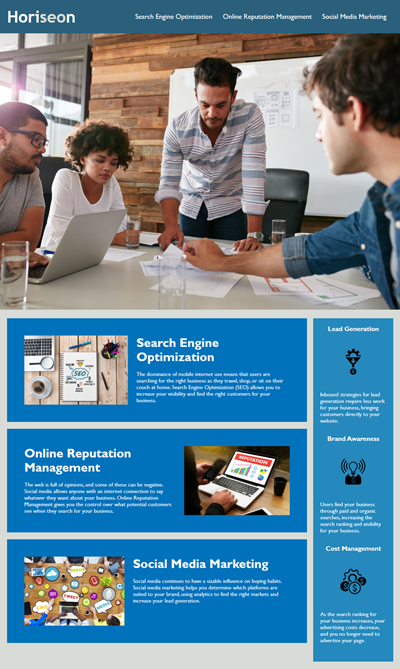

# Horiseon Website 

## About the project 
this project to refactor written code to ensure meets accessibility standards, to make sure CSS style are coded better. 
Here's why: 
* some of the links aren't connect to the id
* most CSS style written repeatedly 
* to show cleaner and clear codes in both HTML and CSS 
* aviod using excusive div in HTML file 
* Adding the header in HTML
## Built with 
* HTML 
* CSS 
## Website Link 
https://moradi1412.github.io/HTMLChallenge/

## Repository Link 
https://github.com/moradi1412/HTMLChallenge 